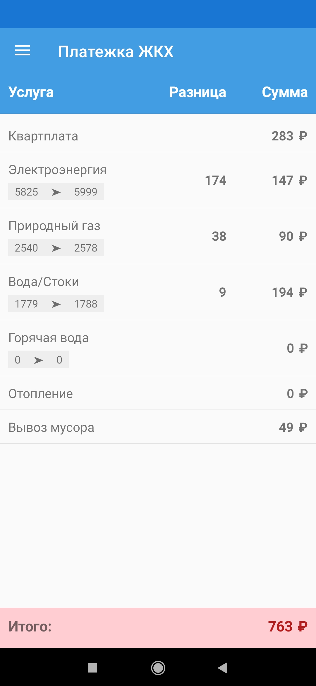
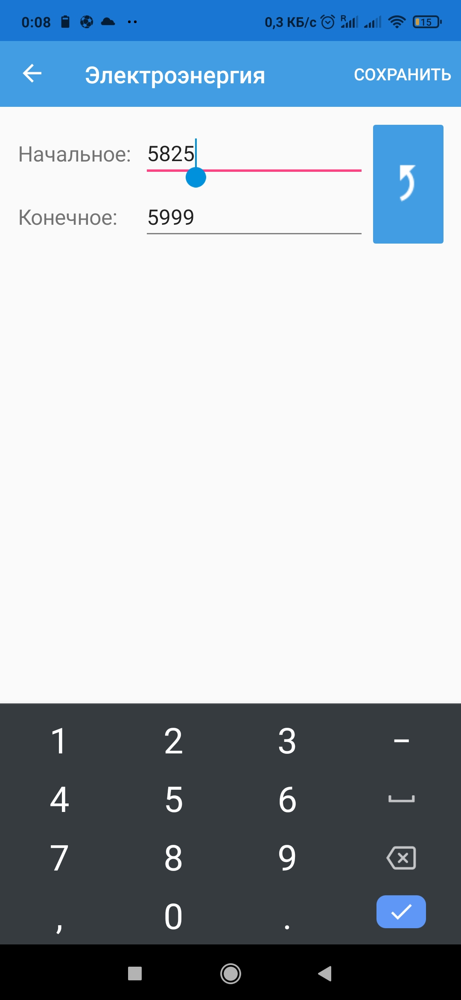
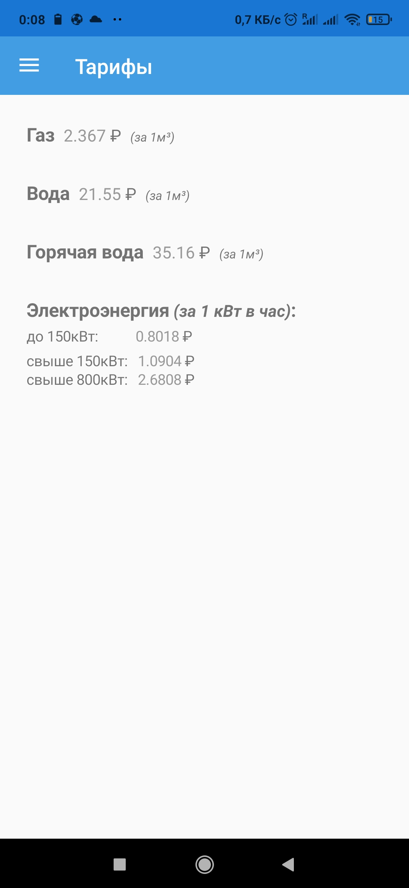
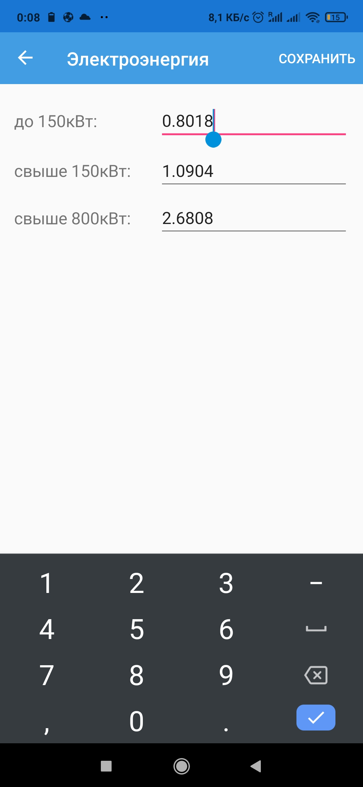

# HCS он же ЖКХ
> Поддерживается только Android 7+ 
> На младших версиях не работает (у меня такой цели не было)

Это простое приложение расчета ЖКХ для личного использования.
Приложение имеет два меню
### Расчет
Главное меню

Расчет происходит реактивно, т.е. при изменении значений полей "Услуг", то будет меняться значение "Итого"

При редактировании, в данном примере "Электроэнергии", есть два поля
начальное значение и конечное

Для удобства была добавлена кнопка переноса конечного значения на начальное
**Все данные сохраняются в памяти телефона, так что заново заполнять ничего не приходится**

> Есть мелкие недочёты 
> Например если очистить поле ввода, то не подставится 0, его нужно ставить самому

### Тарифы
Это меню для настройки тарифов, по которым делается расчет. На случай если они изменятся в бедующем

Вот пример редактирования тарифа Электроэнергия

[Ссылка на apk приложение](https://drive.google.com/file/d/1DC659CPu_CTwzTe9RRuxgZvVg4x5FmQi/view?usp=sharing)
> Поддерживается только Android 7+
